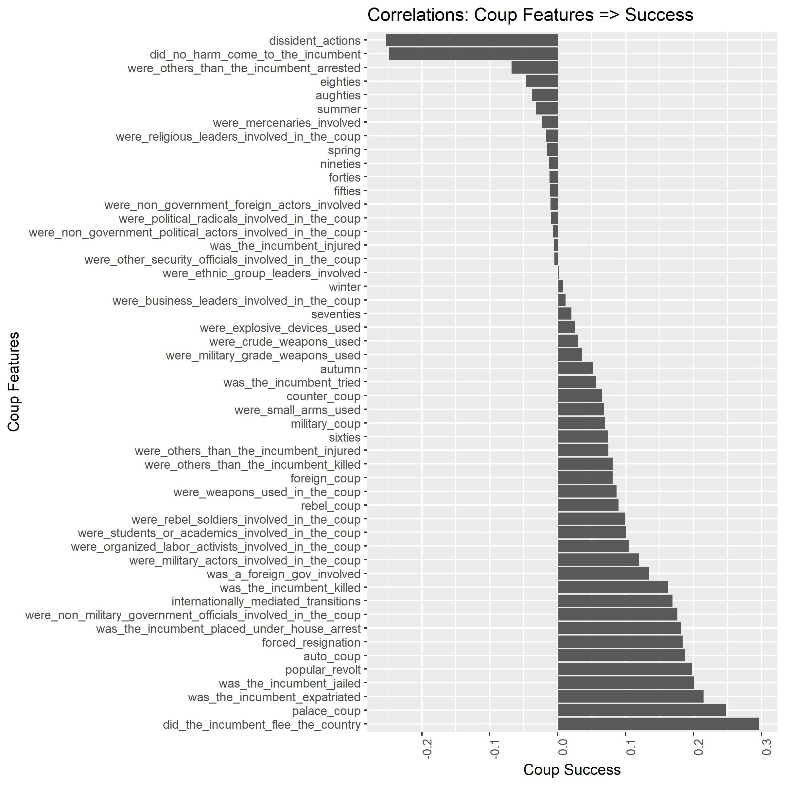

# Can Big Data Predict Revolutions? An Investigation in R
* Public dataset from the Cline Center at the University of Illinois, listing details of all known coups d'etat from the 1940s through 2004
* Data is almost entirely "one-hot encoded" as binary values (1 or 0) describing categorical variables
* A second dataset consisting of country-by-country global economic history data was merged 
* Begins by constructing new variables, e.g., decades, season
* Exploratory data analysis with correlations and visualizations
* Two R scripts were created using only the Cline Center coup dataset to predict the following outcomes:
   * The success or failure of attempted coups
   * The violence or lack thereof of attempted coups
* Another R script was created to predict coup events based on country-by-country economic indicators over time 
* Numerous machine learning algorithms were used to model these outcomes
   * Logistic regression
   * Stepwise forward selection of model features for logistic regression
   * Naive Bayes classification
   * Decision trees classification
   * Random Forest ensemble learning
* Lastly, out-of-sample data on recent coups provides another, mostly successful, test of the models 
* The correlation matrix for coup success is visualized as follows:

